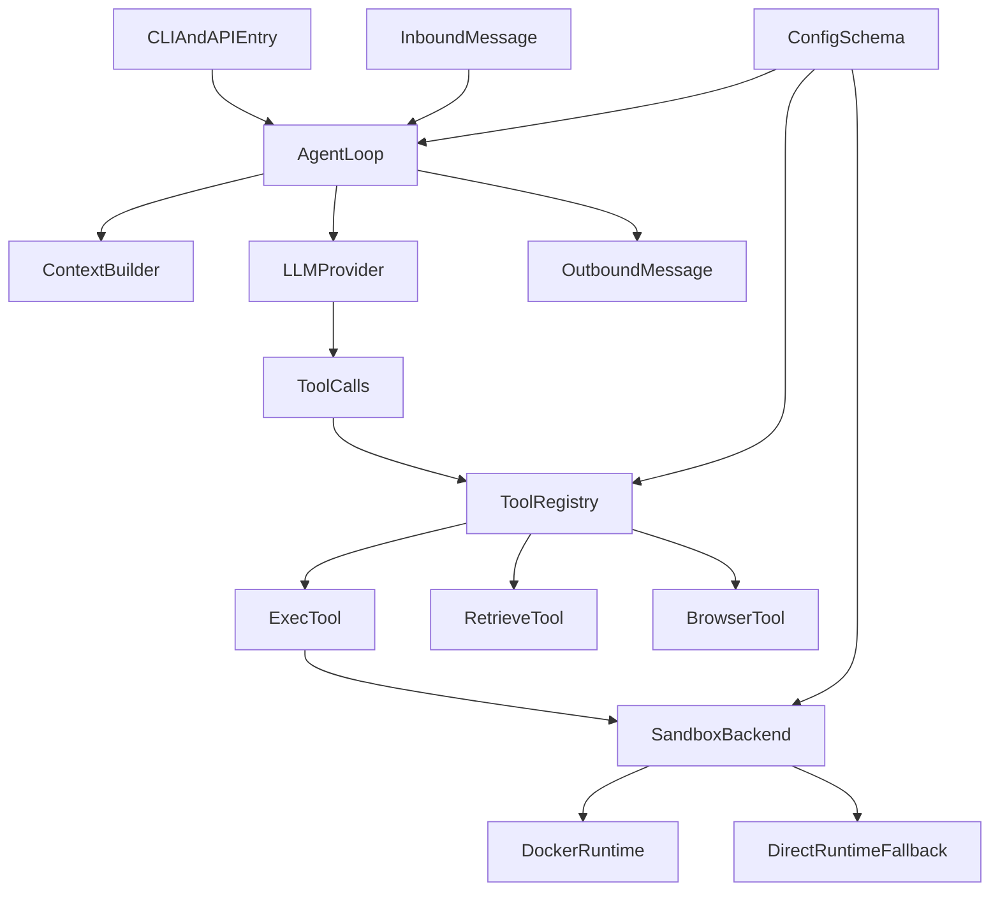

# joyhousebot

官网：<https://joyhouselabs.com>

Python 版 [OpenClaw](https://github.com/openclaw/openclaw)，作为 **agentic 应用基座**。在兼容 OpenClaw 协议与部署方式的基础上，扩展了 traceable、云端任务分派、内置 EVM 钱包、RAG、可插拔记忆系统等能力。

轻量级个人 AI 助手框架：收消息 → 构建上下文 → LLM 推理 → 工具调用（含沙箱执行）→ 写回响应，支持多通道、多 Agent、插件与配置驱动。

## 核心能力

- **Agent 执行闭环**：消息经 MessageBus 入队，AgentLoop 消费后由 ContextBuilder 构建系统提示与历史，调用 LLM；若有工具调用则经 ToolRegistry 执行并回写结果，迭代直到无工具调用或达最大迭代。
- **工具系统**：统一注册与执行（文件、Shell、检索、摄取、浏览器、代码执行、插件等），可选工具由配置 allowlist 控制，参数经 JSON Schema 校验。
- **沙箱执行**：Shell 与代码执行可选用 Docker 一次性容器（网络/用户/工作区隔离），Docker 不可用时自动回退到直接执行。
- **多通道与插件**：支持 Telegram、Discord、Slack、飞书、钉钉、邮件等通道；插件与技能可扩展能力。
- **配置驱动**：Pydantic 配置模型贯穿各层（工作区、Provider、Agent 默认值、工具、通道、插件），支持环境变量覆盖与热更新。

## 快速架构



## 文档

- [设计与架构](docs/DESIGN_AND_ARCHITECTURE.md) — 分层设计、核心组件、执行流程、安全与扩展点
- [CLI 参考](docs/CLI_REFERENCE.md) — 命令与参数说明

## 快速开始

```bash
joyhousebot onboard    # 初始化配置与工作区
joyhousebot gateway    # 启动网关（通道 + 定时任务 + HTTP/WebSocket API）
joyhousebot agent -m "Hello"   # 单条消息对话
joyhousebot agent             # 交互式对话
joyhousebot status            # 查看配置与状态
```

详见 [CLI 参考](docs/CLI_REFERENCE.md)。
