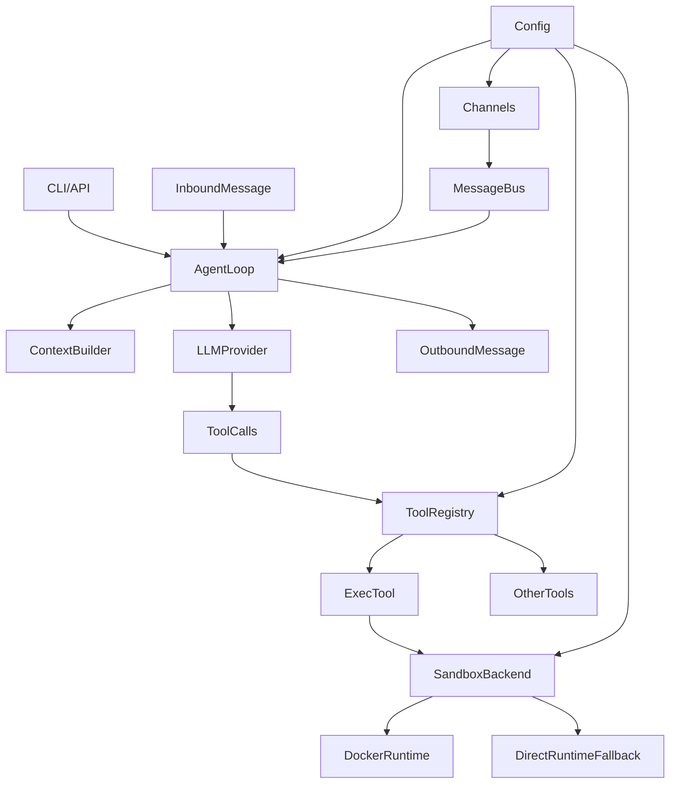

# joyhousebot

<p align="center">
  
</p>

官网：<https://joyhousebot.com>

Python 版 [OpenClaw](https://github.com/openclaw/openclaw) 兼容的轻量级 agentic 应用基座。支持多通道、多 Agent、插件与配置驱动，内置知识库构建、沙箱执行、统一异常处理等能力。

## 核心能力

- **Agent 执行闭环**：消息经 MessageBus 入队，AgentLoop 消费后由 ContextBuilder 构建系统提示与历史，调用 LLM；若有工具调用则经 ToolRegistry 执行并回写结果，迭代直到无工具调用或达最大迭代。
- **工具系统**：统一注册与执行（文件、Shell、Web 检索、摄取、浏览器、代码执行、插件等），可选工具由配置 allowlist 控制，参数经 JSON Schema 校验。
- **沙箱执行**：Shell 与代码执行可选用 Docker 一次性容器（网络/用户/工作区隔离），Docker 不可用时自动回退到直接执行。
- **多通道支持**：支持 Telegram、Discord、Slack、飞书、钉钉、邮件、Mochat、QQ、WhatsApp 等通道。
- **知识库与检索**：内置 FTS5 全文检索 + 向量检索混合搜索，支持 PDF、网页、YouTube 等多种格式摄取。
- **插件与技能**：可扩展的插件系统，兼容 OpenClaw 插件生态；支持技能（Skills）扩展能力。
- **配置驱动**：Pydantic 配置模型贯穿各层（工作区、Provider、Agent 默认值、工具、通道、插件），支持环境变量覆盖与热更新。
- **统一异常处理**：完善的异常类层次、错误分类与敏感信息过滤机制，支持自动重试策略判断。

## 快速架构



## 分层架构

| 层 | 职责 | 主要模块/文件 |
|----|------|----------------|
| 入口层 | CLI 与 HTTP/WebSocket API | `cli/commands.py`、`api/server.py` |
| 编排层 | 消息队列、Agent 主循环、上下文构建 | `bus/queue.py`、`agent/loop.py`、`agent/context.py` |
| 工具层 | 工具注册与执行 | `agent/tools/registry.py`、`agent/tools/*.py` |
| 沙箱层 | 容器/直接执行、容器注册表 | `sandbox/service.py`、`sandbox/docker_backend.py` |
| 配置层 | 配置模型、加载、访问 | `config/schema.py`、`config/loader.py` |
| 通道层 | 各渠道收发 | `channels/*.py` |
| 服务层 | 会话、检索、配置、控制、插件等 | `services/*/` |
| 异常处理 | 统一异常类、错误分类、敏感信息过滤 | `utils/exceptions.py` |

## 文档

- [设计与架构](docs/DESIGN_AND_ARCHITECTURE.md) — 分层设计、核心组件、执行流程、安全与扩展点
- [异常处理](docs/ERROR_HANDLING.md) — 异常类层次、错误分类、敏感信息过滤
- [CLI 参考](docs/CLI_REFERENCE.md) — 命令与参数说明
- [OpenClaw 插件接入](docs/zh/OPENCLAW_PLUGIN_HOST.md)（[English](docs/en/OPENCLAW_PLUGIN_HOST.md)）— plugin_host 使用说明

## 环境要求

- **Python**：>= 3.11（核心与大部分通道仅需 Python）
- **Node.js**：仅在使用 **WhatsApp 通道**时需要，>= 20。首次运行 `joyhousebot channels whatsapp start` 时会从包内拷贝 bridge 到 `~/.joyhousebot/bridges/whatsapp` 并执行 `npm install` / `npm run build`，需本机已安装 `npm`。
- **OpenClaw 插件**：使用内置 plugin_host 无缝接入 OpenClaw 插件时，需配置 `plugins.openclaw_dir`（或环境变量 `JOYHOUSEBOT_OPENCLAW_DIR`），本机需已安装 Node。OpenClaw 目录下需存在 `dist/plugins/loader.js` 或 `src/plugins/loader.ts`。

不使用 WhatsApp 且不使用 OpenClaw 插件时无需安装 Node。

## 快速开始

**首次运行**（如 `pip install joyhousebot` 后）：任意命令首次加载配置时，若 `~/.joyhousebot/config.json` 不存在，会自动创建目录并写入一份默认配置（与当前 schema 一致），无需手动拷贝。

```bash
pip install joyhousebot
joyhousebot onboard    # 初始化配置与工作区
joyhousebot gateway    # 启动网关（通道 + 定时任务 + HTTP/WebSocket API）
joyhousebot agent -m "Hello"   # 单条消息对话
joyhousebot agent             # 交互式对话
joyhousebot status            # 查看配置与状态
```

详见 [CLI 参考](docs/CLI_REFERENCE.md)。

## HTTP API 认证（可选）

HTTP API 复用网关控制认证：当配置了 `gateway.controlToken` 或 `gateway.controlPassword` 时，所有 `/api` 下的 HTTP 请求必须在请求头中携带对应凭证（`Authorization: Bearer <controlToken>`、`X-API-Key: <controlToken>` 或 `X-Control-Password: <controlPassword>`），否则返回 401。未配置时不做校验，便于本地开发。

- **前端**：启用认证时需配置环境变量 `VITE_HTTP_API_TOKEN`（与 `gateway.controlToken` 一致），构建或开发时注入，以便 UI 请求通过认证。
- **CLI**：调用 `/api` 的接口（如 `message send`）会自动从配置读取 `controlToken` 并附带在请求头中。
- **安全**：不要将 token 提交到仓库；生产环境建议设置强 token 并配合 HTTPS 使用。

## 内置工具

| 工具 | 功能 | 说明 |
|------|------|------|
| `read_file` | 读取文件 | 支持按行号范围读取 |
| `write_file` | 写入文件 | 覆盖写入 |
| `edit_file` | 编辑文件 | 基于旧内容进行编辑 |
| `list_dir` | 列出目录 | 支持递归 |
| `exec` | 执行 Shell 命令 | 支持 Docker 容器隔离 |
| `web_search` | Web 搜索 | 使用 Brave Search API |
| `web_fetch` | 获取网页内容 | 支持 Markdown/Text 提取 |
| `retrieve` | 知识库检索 | FTS5 + 向量混合检索 |
| `ingest` | 摄取内容到知识库 | 支持 PDF、网页、YouTube 等 |
| `message` | 发送消息 | 支持通道内发送 |
| `spawn` | 启动子代理 | 多代理协作 |
| `cron` | 定时任务管理 | 创建/删除定时任务 |
| `code_runner` | 代码执行 | 支持 Claude Code 后端 |
| `browser` | 浏览器自动化 | 截图、导航等 |
| `canvas` | Canvas 画布操作 | 编辑器集成 |
| `open_app` | 打开应用 | 插件应用 |
| `plugin_invoke` | 调用插件工具 | 插件工具调用 |

## 配置示例

```json
{
  "agents": {
    "defaults": {
      "model": "gpt-4",
      "model_fallbacks": ["gpt-3.5-turbo"],
      "max_iterations": 10,
      "temperature": 0.7
    }
  },
  "tools": {
    "optional_allowlist": ["code_runner", "browser"],
    "exec": {
      "container_enabled": true,
      "deny_patterns": ["rm -rf", "format", "shutdown"]
    },
    "retrieval": {
      "memory_use_l0": true,
      "memory_first": true
    }
  },
  "channels": {
    "telegram": {
      "enabled": true,
      "token": "your-telegram-bot-token"
    }
  },
  "providers": {
    "openai": {
      "api_key": "sk-..."
    }
  }
}
```

## 许可证

[MIT License](LICENSE)
