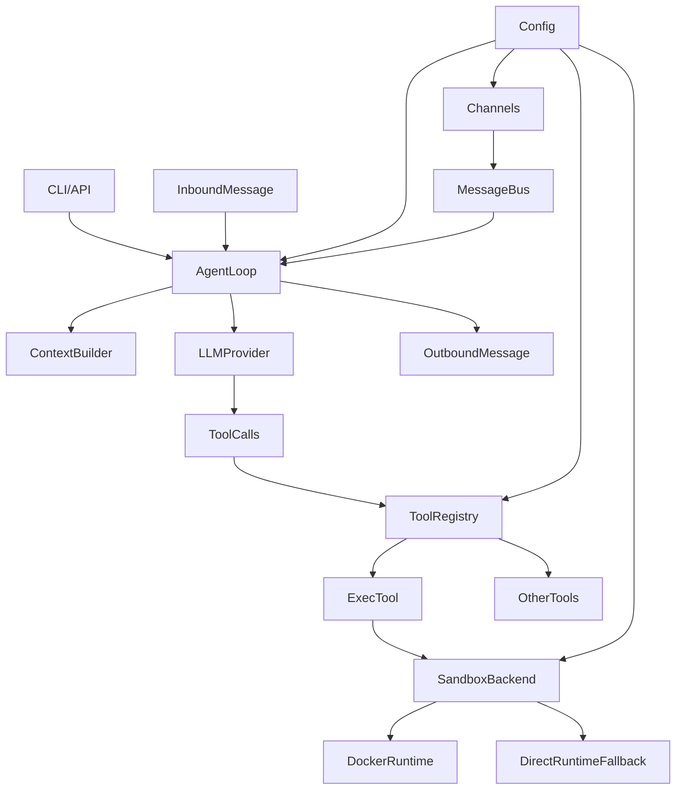

# joyhousebot

<p align="center">
  
</p>

Website: <https://joyhousebot.com>

A lightweight agentic application base compatible with the Python version of [OpenClaw](https://github.com/openclaw/openclaw). Supports multi-channel, multi-agent, plugin-driven, and configuration-driven architecture, with built-in knowledge base construction, sandbox execution, unified exception handling, and more.

## Core Capabilities

- **Agent Execution Loop**: Messages are queued via MessageBus, consumed by AgentLoop, and the system prompt and history are constructed by ContextBuilder to call LLM. If there are tool calls, they are executed through ToolRegistry and results are written back, iterating until no tool calls remain or maximum iterations are reached.
- **Tool System**: Unified registration and execution (file, Shell, Web search, ingestion, browser, code execution, plugins, etc.). Optional tools are controlled by configuration allowlist, with parameters validated via JSON Schema.
- **Sandbox Execution**: Shell and code execution can optionally use Docker one-time containers (network/user/workspace isolation), with automatic fallback to direct execution when Docker is unavailable.
- **Multi-channel Support**: Supports Telegram, Discord, Slack, Feishu, DingTalk, Email, MoChat, QQ, WhatsApp, and other channels.
- **Knowledge Base & Retrieval**: Built-in FTS5 full-text search + vector search hybrid retrieval, supporting ingestion from PDF, web pages, YouTube, and other formats.
- **Plugins & Skills**: Extensible plugin system compatible with OpenClaw plugin ecosystem; supports Skills for capability extension.
- **Configuration-driven**: Pydantic configuration models across all layers (workspace, Provider, Agent defaults, tools, channels, plugins), with environment variable override support and hot reloading.
- **Unified Exception Handling**: Complete exception class hierarchy, error classification, and sensitive information filtering mechanism, supporting automatic retry policy detection.

## Quick Architecture



## Layered Architecture

| Layer | Responsibilities | Main Modules/Files |
|-------|------------------|---------------------|
| Entry Layer | CLI and HTTP/WebSocket API | `cli/commands.py`, `api/server.py` |
| Orchestration Layer | Message queue, Agent main loop, context building | `bus/queue.py`, `agent/loop.py`, `agent/context.py` |
| Tool Layer | Tool registration and execution | `agent/tools/registry.py`, `agent/tools/*.py` |
| Sandbox Layer | Container/direct execution, container registry | `sandbox/service.py`, `sandbox/docker_backend.py` |
| Configuration Layer | Configuration models, loading, access | `config/schema.py`, `config/loader.py` |
| Channel Layer | Send/receive for each channel | `channels/*.py` |
| Service Layer | Session, retrieval, config, control, plugins, etc. | `services/*/` |
| Exception Handling | Unified exception classes, error classification, sensitive info filtering | `utils/exceptions.py` |

## Documentation

- [Design & Architecture](docs/DESIGN_AND_ARCHITECTURE.md) — Layered design, core components, execution flow, security, and extension points
- [Error Handling](docs/ERROR_HANDLING.md) — Exception class hierarchy, error classification, sensitive information filtering
- [CLI Reference](docs/CLI_REFERENCE.md) — Commands and parameter descriptions
- [OpenClaw Plugin Hosting](docs/en/OPENCLAW_PLUGIN_HOST.md) — plugin_host usage guide

## Environment Requirements

- **Python**: >= 3.11 (core and most channels only require Python)
- **Node.js**: Only required when using the **WhatsApp channel**, >= 20. On first run of `joyhousebot channels whatsapp start`, the bridge will be copied from the package to `~/.joyhousebot/bridges/whatsapp` and `npm install` / `npm run build` will be executed. You must have `npm` installed locally.
- **OpenClaw Plugins**: When using the built-in plugin_host to seamlessly integrate OpenClaw plugins, you need to configure `plugins.openclaw_dir` (or environment variable `JOYHOUSEBOT_OPENCLAW_DIR`), and Node.js must be installed locally. The OpenClaw directory must contain `dist/plugins/loader.js` or `src/plugins/loader.ts`.

Node.js is not required if you are not using WhatsApp and not using OpenClaw plugins.

## Local Development & Debugging

### Environment Setup

```bash
# Clone repository
git clone https://github.com/JoyHouseLabs/joyhousebot.git
cd joyhousebot

# Install Python dependencies (recommended: use uv)
pip install uv
uv sync

# Or editable install with pip
pip install -e ".[dev]"
```

### Starting the Backend

```bash
# Start gateway service (includes HTTP/WebSocket API, channels, scheduled tasks)
uv run joyhousebot gateway --port 18790

# Or run directly
joyhousebot gateway --port 18790
```

After the gateway starts:
- HTTP API: `http://localhost:18790/api/...`
- WebSocket RPC: `ws://localhost:18790/ws/rpc`
- WebSocket Chat: `ws://localhost:18790/ws/chat`
- Built-in UI: `http://localhost:18790/ui/`

### Starting the Frontend Development Server

```bash
cd frontend
npm install
npm run dev
```

During development, Vite will proxy `/config`, `/health`, `/chat`, `/v1` and other requests to `http://127.0.0.1:18790`. Make sure the backend is running.

Frontend dev server URL: `http://localhost:5174/ui/`

**Start both frontend and backend in one command** (requires concurrently):

```bash
cd frontend
npm run dev:full
```

### Running Tests

```bash
# Run all tests
uv run pytest

# Run a single test file
uv run pytest tests/test_agent_memory.py

# Run e2e tests (requires full runtime environment)
uv run pytest -m e2e

# Skip tests that require pairing
uv run pytest -m "not requires_pairing"
```

### Code Linting

```bash
# Ruff lint
uv run ruff check joyhousebot/ tests/ scripts/

# Auto-fix
uv run ruff check --fix joyhousebot/ tests/ scripts/
```

### Building & Packaging

```bash
# Build frontend only and copy to static/ui
./scripts/build-ui.sh

# Build frontend + package Python wheel
./scripts/build-and-package.sh

# Install locally after build
./scripts/build-and-package.sh --install
```

## Quick Start

**First Run** (after `pip install joyhousebot`): On the first load of configuration by any command, if `~/.joyhousebot/config.json` does not exist, a default configuration (consistent with the current schema) will be automatically created in the directory. No manual copying is needed.

```bash
pip install joyhousebot
joyhousebot onboard    # Initialize configuration and workspace
joyhousebot gateway    # Start gateway (channels + scheduled tasks + HTTP/WebSocket API)
joyhousebot agent -m "Hello"   # Single message conversation
joyhousebot agent             # Interactive conversation
joyhousebot status            # View configuration and status
```

For details, see [CLI Reference](docs/CLI_REFERENCE.md).

## HTTP API Authentication (Optional)

The HTTP API shares gateway control authentication: when `gateway.controlToken` or `gateway.controlPassword` is configured, all HTTP requests under `/api` must carry the corresponding credential in the request header (`Authorization: Bearer <controlToken>`, `X-API-Key: <controlToken>` or `X-Control-Password: <controlPassword>`), otherwise it returns 401. When not configured, no validation is performed for local development convenience.

- **Frontend**: When authentication is enabled, you need to configure the environment variable `VITE_HTTP_API_TOKEN` (consistent with `gateway.controlToken`), which will be injected during build or dev time so that UI requests pass authentication.
- **CLI**: Calls to `/api` interfaces (such as `message send`) will automatically read `controlToken` from configuration and include it in the request header.
- **Security**: Do not commit tokens to the repository; in production, set strong tokens and use with HTTPS.

## Built-in Tools

| Tool | Function | Description |
|------|----------|-------------|
| `read_file` | Read file | Supports reading by line number range |
| `write_file` | Write file | Overwrite write |
| `edit_file` | Edit file | Edit based on old content |
| `list_dir` | List directory | Supports recursion |
| `exec` | Execute Shell command | Supports Docker container isolation |
| `web_search` | Web search | Uses Brave Search API |
| `web_fetch` | Fetch web content | Supports Markdown/Text extraction |
| `retrieve` | Knowledge base retrieval | FTS5 + vector hybrid retrieval |
| `ingest` | Ingest content to knowledge base | Supports PDF, web pages, YouTube, etc. |
| `message` | Send message | Supports sending within channels |
| `spawn` | Start sub-agent | Multi-agent collaboration |
| `cron` | Scheduled task management | Create/delete scheduled tasks |
| `code_runner` | Code execution | Supports Claude Code backend |
| `browser` | Browser automation | Screenshots, navigation, etc. |
| `canvas` | Canvas operations | Editor integration |
| `open_app` | Open application | Plugin application |
| `plugin_invoke` | Call plugin tool | Plugin tool invocation |

## Configuration Example

```json
{
  "agents": {
    "defaults": {
      "model": "gpt-4",
      "model_fallbacks": ["gpt-3.5-turbo"],
      "max_iterations": 10,
      "temperature": 0.7
    }
  },
  "tools": {
    "optional_allowlist": ["code_runner", "browser"],
    "exec": {
      "container_enabled": true,
      "deny_patterns": ["rm -rf", "format", "shutdown"]
    },
    "retrieval": {
      "memory_use_l0": true,
      "memory_first": true
    }
  },
  "channels": {
    "telegram": {
      "enabled": true,
      "token": "your-telegram-bot-token"
    }
  },
  "providers": {
    "openai": {
      "api_key": "sk-..."
    }
  }
}
```

## License

[MIT License](LICENSE)
