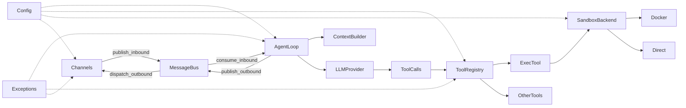

# joyhousebot 设计与架构

本文档基于当前代码实现，描述 joyhousebot 的分层设计、核心组件、执行流程、安全边界与扩展点。

---

## 一、设计原则

- **分层清晰**：入口层（CLI / API）→ 编排层（AgentLoop + MessageBus）→ 工具层（ToolRegistry + 各工具）→ 沙箱层（Docker / 直接执行），职责明确。
- **解耦**：通道与 Agent 通过 MessageBus 解耦；单 FIFO 入队、单消费者（AgentLoop），出队经 `subscribe_outbound` 分发给各 channel。
- **可扩展**：工具动态注册与 allowlist 控制；插件与技能可扩展能力；Provider 抽象支持多模型与降级。
- **安全边界**：命令守卫（deny_patterns / allow_patterns）、工作区限制（restrict_to_workspace）、沙箱隔离（网络/用户/工作区）、工具参数 JSON Schema 校验。
- **统一异常处理**：异常类层次、错误分类、敏感信息过滤贯穿各层。

---

## 二、总体架构与数据流

### 2.1 分层结构

| 层 | 职责 | 主要模块/文件 |
|----|------|----------------|
| 入口层 | CLI 与 HTTP/WebSocket API | `cli/commands.py`、`api/server.py` |
| 编排层 | 消息队列、Agent 主循环、上下文构建 | `bus/queue.py`、`agent/loop.py`、`agent/context.py` |
| 工具层 | 工具注册与执行 | `agent/tools/registry.py`、`agent/tools/*.py` |
| 沙箱层 | 容器/直接执行、容器注册表 | `sandbox/service.py`、`sandbox/docker_backend.py` |
| 配置层 | 配置模型、加载、访问 | `config/schema.py`、`config/loader.py`、`config/access.py` |
| 通道层 | 各渠道收发 | `channels/*.py` |
| 服务层 | 会话、检索、配置、控制、插件等 | `services/*/` |
| 异常处理 | 统一异常类、错误分类、敏感信息过滤 | `utils/exceptions.py` |

### 2.2 数据流概览

- **入站**：各 channel 将用户消息封装为 `InboundMessage`，调用 `MessageBus.publish_inbound()` 入队。
- **消费**：`AgentLoop.run()` 中通过 `consume_inbound()`（带 1s 超时轮询）取消息，交给 `_process_message()`。
- **处理**：构建上下文（ContextBuilder）、调用 LLM、若有 tool_calls 则经 ToolRegistry 执行，结果追加到消息列表并继续迭代，直到无工具调用或达到 `max_iterations`。
- **出站**：将 `OutboundMessage` 经 `publish_outbound()` 写入总线，`dispatch_outbound()` 分发给订阅该 channel 的回调。

---

## 三、核心组件详解

### 3.1 AgentLoop（编排引擎）

- **位置**：`joyhousebot/agent/loop.py`
- **职责**：收消息 → ContextBuilder（历史、记忆、技能）→ LLM → 工具调用 → 写回响应；多 agent 时按 `agent_id` 选择配置。
- **主循环**：`_run_agent_loop(initial_messages, ...)` 在 `while iteration < max_iterations` 内调用 `_call_provider_with_fallback()` 获取 LLM 响应；若 `response.has_tool_calls` 则遍历 `response.tool_calls`，调用 `ToolRegistry.execute()`，将结果通过 `context.add_tool_result()` 追加，并可选追加 `after_tool_results_prompt`；无工具调用时退出并返回最终内容。
- **退出条件**：迭代数达到 `max_iterations`、本轮无 tool_calls、或 `check_abort_requested()` 为真。
- **异常处理**：使用 `LLMError`、`classify_exception` 和 `sanitize_error_message` 处理 LLM 调用失败，自动过滤敏感信息。
- **依赖注入**：MessageBus、LLMProvider、workspace、model/model_fallbacks、max_iterations、temperature、max_tokens、memory_window、max_context_tokens、exec_config、session_manager、config 等，均来自配置或上层构造。

### 3.2 ContextBuilder（上下文构建）

- **位置**：`joyhousebot/agent/context.py`
- **职责**：组装系统提示（system prompt）与消息列表，供 LLM 使用。
- **系统提示组成**（`build_system_prompt`）：
  1. **Core identity**：`IDENTITY.md`。
  2. **Bootstrap 文件**：`AGENTS.md`、`SOUL.md`、`USER.md`、`TOOLS.md`、`IDENTITY.md`（由 `BOOTSTRAP_FILES` 定义）。
  3. **Memory**：根据配置 `tools.retrieval.memory_use_l0` 决定是否使用 L0 + MEMORY.md；可选 `memory_first` 提示。
  4. **Skills**：始终加载的 skill 全文 + 其余 skill 的摘要（agent 通过 read_file 按需加载）。
  5. **Installed Apps / Plugin Tools**：来自插件发现，供 `open_app` 与 `plugin_invoke` 使用。
- **配置影响**：`skills.entries.<name>.enabled`、`tools.retrieval.memory_use_l0`、`tools.retrieval.memory_first`。

### 3.3 ToolRegistry（工具注册与执行）

- **位置**：`joyhousebot/agent/tools/registry.py`
- **职责**：统一注册与执行工具；可选工具由 `optional_allowlist` 控制是否启用。
- **执行流程**（`execute`）：按 name 取工具 → `_is_enabled(name)` 检查（可选工具不在 allowlist 则禁用）→ `tool.validate_params(params)` → `await tool.execute(**params, **extra_kwargs)`；异常时返回 `"Error executing {name}: {str(e)}"`。
- **默认注册工具**（在 AgentLoop 初始化时）：文件（read_file、write_file、edit_file、list_dir）、Shell（exec）、Web（web_search、web_fetch）、摄取（ingest）、检索（retrieve）、消息（message）、子代理（spawn）、定时任务（cron）、进程（process）、代码执行（code_runner）、浏览器（browser）、Canvas、open_app、plugin_invoke 等；部分为 optional，由配置 `tools.optional_allowlist` 控制。
- **异常处理**：工具使用 `@tool_error_handler` 装饰器统一处理异常。

### 3.4 MessageBus（消息总线）

- **位置**：`joyhousebot/bus/queue.py`
- **职责**：异步 FIFO 队列，解耦 channel 与 Agent。单生产者多消费者入队、单消费者（AgentLoop）消费入站；出站由 `dispatch_outbound` 按 channel 分发给订阅者。
- **主要接口**：`publish_inbound` / `consume_inbound`、`publish_outbound` / `consume_outbound`、`subscribe_outbound(channel, callback)`、`dispatch_outbound()`（需后台任务运行）。

### 3.5 Sandbox（沙箱执行）

- **位置**：`joyhousebot/sandbox/service.py`、`joyhousebot/sandbox/docker_backend.py`、`joyhousebot/sandbox/registry.py`
- **职责**：
  - **Docker 后端**：一次性容器执行（`docker run --rm`），支持工作区挂载、超时、用户与网络配置；默认 `network=none`。
  - **Registry**：持久化容器元数据（`sandbox_runtime` 键下的 containers / recreateOps），用于列表与清理记录。
  - **服务层**：`list_containers_local`、`recreate_containers_local`、`explain_local()`（根据 `is_docker_available()` 返回 `"docker"` 或 `"direct"`）。
- **与工具集成**：`ExecTool` 在 `container_enabled=True` 时优先 Docker，不可用或失败时回退到直接执行；CodeRunner 的 container 模式同样使用 Docker 后端。
- **配置**：`tools.exec.container_enabled`、`container_image`、`container_workspace_mount`、`container_user`、`container_network` 等（见 `config/schema.py` 中 ExecToolConfig）。

### 3.6 Config（配置模型）

- **位置**：`joyhousebot/config/schema.py`、`loader.py`、`access.py`
- **职责**：Pydantic 模型定义（BaseSettings），持久化到 `~/.joyhousebot/config.json`，支持环境变量覆盖。
- **与各层关系**：AgentLoop 的 model、model_fallbacks、max_iterations、memory_window、max_context_tokens 等来自 AgentDefaults/AgentEntry；ToolRegistry 的 optional_allowlist 来自 ToolsConfig；ExecTool/沙箱使用 ExecToolConfig；ContextBuilder 读取 skills、retrieval（memory_use_l0、memory_first）；MessagesConfig 控制 after_tool_results_prompt、suppress_tool_errors、response_prefix 等。

### 3.7 统一异常处理

- **位置**：`joyhousebot/utils/exceptions.py`
- **职责**：提供异常类层次、错误分类、敏感信息过滤、工具装饰器等。
- **异常类层次**：
  - `JoyhouseBotError`（基类）
  - `ValidationError`（输入验证）
  - `NotFoundError`（资源未找到）
  - `PermissionError`（权限拒绝）
  - `TimeoutError`（超时）
  - `RateLimitError`（限流）
  - `LLMError`（LLM 调用）
  - `ToolError`（工具执行）
  - `ChannelError`（通道错误）
  - `PluginError`（插件错误）
- **错误分类**：`ErrorCategory` 枚举（RECOVERABLE/RETRYABLE/FATAL/VALIDATION/NOT_FOUND/PERMISSION/TIMEOUT/RATE_LIMIT）。
- **敏感信息过滤**：`sanitize_error_message()` 函数自动过滤 API key、token 等敏感数据。
- **异常分类器**：`classify_exception()` 自动判断异常类型和重试策略。

---

## 四、关键执行流程（单条消息从输入到输出）

1. **入队**：Channel 收到用户消息 → 构造 `InboundMessage`（channel、session_id、content 等）→ `MessageBus.publish_inbound(msg)`。
2. **消费**：AgentLoop 在 `run()` 中 `await asyncio.wait_for(bus.consume_inbound(), timeout=1.0)` 取消息（超时则继续循环）。
3. **预处理**：`_process_message()` 内处理系统消息、命令（如 `/new`、`/help`、`/approve`），按 session 加载历史。
4. **构建消息列表**：`ContextBuilder.build_messages()` 得到 system prompt + 历史消息（受 memory_window / max_context_tokens 约束）+ 当前用户消息。
5. **主循环**：
   - 调用 `_call_provider_with_fallback()` 得到 LLM 响应（支持流式；失败时按 model_fallbacks 与 profile 降级，带冷却）。
   - 若有 tool_calls：对每个调用 `ToolRegistry.execute(name, params)`，将结果追加到消息列表并附加 after_tool_results_prompt，迭代次数 +1，继续循环。
   - 若无 tool_calls：退出循环，得到最终 assistant 内容。
6. **后处理**：可选 `resolve_response_prefix` 拼前缀；会话保存（Session.add_message + SessionManager.save）；可选记忆合并（_consolidate_memory）。
7. **出站**：构造 `OutboundMessage`，`MessageBus.publish_outbound(msg)`；`dispatch_outbound` 将消息发给订阅该 channel 的回调，由各 channel 发送给用户。

---

## 五、安全与容错

### 5.1 命令与路径安全

- **ExecTool**（`agent/tools/shell.py`）：`deny_patterns` 禁止危险命令（如 rm -rf、format、shutdown）；可选 `allow_patterns` 白名单；`restrict_to_workspace` 且非 shell_mode 时限制 shell 元字符（如 `|&;<>()$`）；文件操作限制在工作区内。

### 5.2 LLM 调用容错

- **模型降级**：主模型失败时按 `model_fallbacks` 依次尝试；同一模型可配置多 auth profile，按 `resolve_profile_order` 尝试。
- **冷却**：失败模型进入冷却期（指数退避，最大约 5 分钟），避免反复踩同一故障。
- **最终兜底**：所有模型与 profile 均失败时返回 "All models failed"。
- **异常处理**：使用 `LLMError`、`classify_exception` 和 `sanitize_error_message` 处理 LLM 调用失败。

### 5.3 工具执行

- **参数校验**：各工具通过 `validate_params`（JSON Schema）校验类型、枚举、范围等。
- **错误返回**：执行异常时返回 `"Error executing {name}: {str(e)}"`；配置 `messages.suppress_tool_errors` 为真时可对用户隐藏详细错误。
- **统一异常处理**：工具使用 `@tool_error_handler` 装饰器统一处理异常，自动分类和过滤敏感信息。

### 5.4 沙箱隔离

- **网络**：默认 `network=none`，可配置为 host 或桥接。
- **用户**：支持 `container_user`（如 `1000:1000`）非 root 运行。
- **工作区**：仅挂载指定工作区目录到容器内。
- **标签**：沙箱容器带 `joyhousebot.sandbox=1` 便于识别与清理。

### 5.5 通道容错

- **连接重试**：通道连接失败时根据错误分类决定是否重试（`ErrorCategory.RETRYABLE`）。
- **异常处理**：使用 `ChannelError` 和 `classify_exception` 处理通道错误。
- **敏感信息过滤**：使用 `sanitize_error_message` 过滤错误消息中的敏感数据。

---

## 六、扩展点

- **新工具**：实现 `agent/tools/base.py` 中的 `Tool` 接口（name、description、parameters、validate_params、execute），在 AgentLoop 初始化时通过 `ToolRegistry.register()` 注册；若为可选工具，设置 `optional=True` 并在配置中通过 `tools.optional_allowlist` 启用；使用 `@tool_error_handler` 装饰器统一处理异常。
- **新通道**：实现 channel 逻辑，将用户消息转为 `InboundMessage` 调用 `MessageBus.publish_inbound()`，并 `subscribe_outbound(channel_id, callback)` 接收出站消息并发送给用户；使用 `ChannelError` 处理异常。
- **新 Provider**：实现 `providers/base.py` 中的 `LLMProvider` 接口，在配置中指定 provider 与 model，由现有 `_call_provider_with_fallback` 与 profile 机制集成。
- **插件**：通过插件系统注册 open_app 与 plugin_invoke 工具，ContextBuilder 会从 `get_installed_apps_for_agent` / `get_plugin_tool_names_for_agent` 拉取并写入系统提示；使用 `PluginError` 处理异常。
- **技能**：在工作区 `skills/<name>/` 下提供 SKILL.md 等，在 `config.skills.entries` 中配置并设置 `enabled`；ContextBuilder 会加载始终加载技能的全文与其余技能的摘要。

---

## 七、相关文档

- [README](../README.md) — 项目概览与快速开始
- [异常处理](ERROR_HANDLING.md) — 异常类层次、错误分类、敏感信息过滤
- [CLI 参考](CLI_REFERENCE.md) — 命令与参数说明
